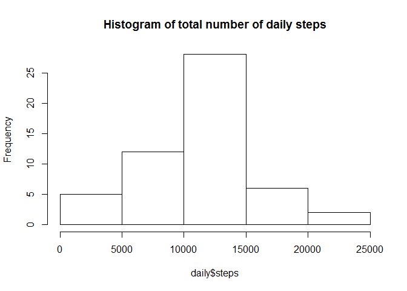
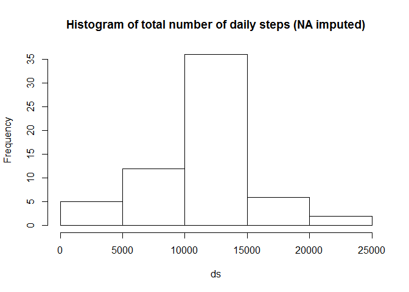
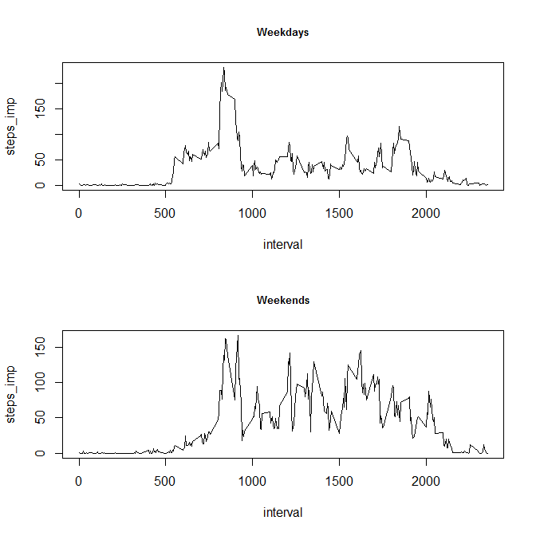

# Reproducible Research: Peer Assessment 1


## Loading and preprocessing the data
These are the libraries used to compile this code:

```r
library(knitr)
library(dplyr)
datazip <- "activity.zip"
datafile <- unzip(datazip)
d <- read.csv(datafile, header=TRUE)
```


## What is mean total number of steps taken per day?
1 - Here is a histogram of the steps taken each day 

```r
daily <- aggregate(steps ~ date, d,sum)
hist(daily$steps, main = "Histogram of total number of daily steps")
```

<!-- -->

2 - Here is some code to calculate the mean and median

```r
msteps <- mean(daily$steps)
medsteps <- median(daily$steps)
```
The mean number of steps taken per day is 10766, and the median is 10765.  


## What is the average daily activity pattern?
1 - Here is a plot of the average number of steps in a given 5-minute interval

```r
mean_byint<-aggregate(steps ~ interval, d, mean)
plot(steps ~ interval, type="l", data=mean_byint)
```

<!-- -->

2 - Here we find out what the maximum interval is, and when it occurrs  


```r
max <- max(mean_byint$steps)
maxint <- filter(mean_byint, steps == max)[1,1]
maxhr <- floor(maxint/100) 
maxmin <- maxint-maxhr*100
```
The interval with maximum average number is of steps taken is the one starting at 8:35. The subject took 206.1698113 steps at that time of the day. 


## Imputing missing values
1 - Finding the missing values 

```r
cmiss<-count(d, is.na(steps))
nmiss<-cmiss[[2,2]]
nmiss 
```

```
## [1] 2304
```


2,3- Replacing missing values with mean of that interval for other days 

```r
colnames(mean_byint) <- c("interval", "meansteps")
dd<-right_join(d, mean_byint, by=c("interval","interval"))
dd$steps_imp <- ifelse(is.na(dd$steps),dd$meansteps, dd$steps) 
daily_imp <- aggregate(steps_imp ~ date, dd,sum)
ds<-daily_imp$steps_imp
```

4 - This is a histogram of the data with missing values (NA) imputed

```r
hist(ds,main = "Histogram of total number of daily steps (NA imputed)")
```

<!-- -->

```r
mds <-median(ds)
medds <- mean(ds)
```
The mean of this new dataset is 10766 and the median is 10766. 


## Are there differences in activity patterns between weekdays and weekends?
1 - Splitting weekdays and weekends:  

```r
dd$wkday = weekdays(as.Date(dd$date))
dd$dayfac = as.factor(dd$wkday %in% c("Saturday","Sunday"))
dd$wkendf <- factor(dd$dayfac, labels=c("Weekday", "Weekend"))
mean_bywkd<-aggregate(steps_imp ~ interval + wkendf , dd, mean)
wd <- mean_bywkd[mean_bywkd$wkendf=="Weekday",]
we <- mean_bywkd[mean_bywkd$wkendf=="Weekend",]
```

2 - Plotting two line graphs, for weekdays and weekends

```r
par(mfrow=c(2,1))
plot(steps_imp ~ interval, type="l", data=wd, main="Weekdays", cex.main=0.8)
plot(steps_imp ~ interval, type="l", data=we, main="Weekends", cex.main=0.8)
mtext("Average number of steps taken during the day", side = 3, outer = TRUE, cex = 1 , col = "grey20")
```

<!-- -->


